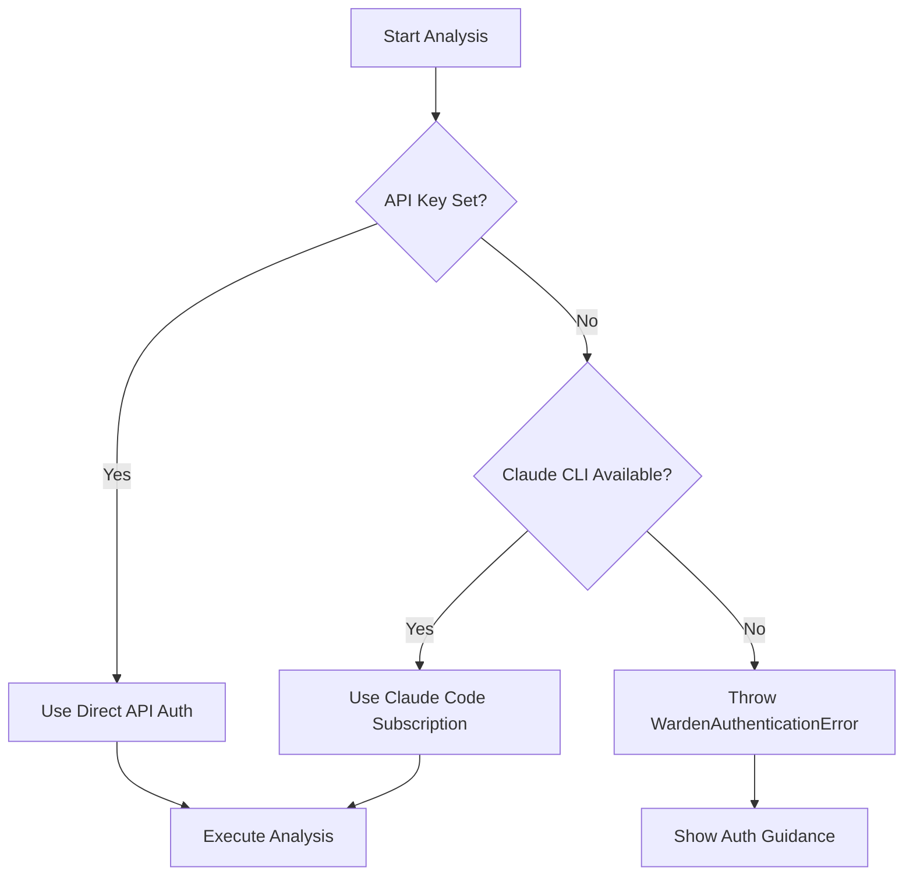

Warden supports two authentication methods: direct API keys and Claude Code CLI subscription authentication.

## Authentication Methods

Warden automatically detects your authentication setup in this order:

<Steps>
  <Step title="API Key (Direct)">
    If `WARDEN_ANTHROPIC_API_KEY` is set, Warden uses direct API authentication.
  </Step>
  <Step title="Claude Code CLI (Subscription)">
    If no API key is found, Warden falls back to the Claude Code CLI binary and uses your Claude Code subscription.
  </Step>
</Steps>

## Using API Keys

### Setting Your API Key

Export your Anthropic API key as an environment variable:

```bash
export WARDEN_ANTHROPIC_API_KEY=sk-ant-...
```

<Note>
API keys can be obtained from the [Anthropic Console](https://console.anthropic.com/).
</Note>

### GitHub Actions

For CI/CD pipelines, store your API key as a GitHub secret:

```yaml .github/workflows/warden.yml
name: Warden PR Review
on:
  pull_request:
    types: [opened, synchronize]

jobs:
  review:
    runs-on: ubuntu-latest
    steps:
      - uses: actions/checkout@v4
      - uses: getsentry/warden@v1
        with:
          anthropic-api-key: ${{ secrets.WARDEN_ANTHROPIC_API_KEY }}
```

<Warning>
Never commit API keys to your repository. Always use environment variables or secrets management.
</Warning>

## Using Claude Code CLI

### Installation

Install the Claude Code CLI:

```bash
curl https://claude.ai/install.sh | sh
```

### Authentication

Log in to your Claude Code account:

```bash
claude login
```

Warden will automatically use your Claude Code subscription for API calls.

### Pre-flight Verification

Warden performs authentication checks before starting analysis. Here's how it works:

```typescript src/sdk/auth.ts
export function verifyAuth({ apiKey }: { apiKey?: string }): void {
  // Direct API auth — no subprocess needed
  if (apiKey) return;

  try {
    execFileNonInteractive('claude', ['--version'], { timeout: 5000 });
  } catch (error) {
    const isNotFound =
      error instanceof ExecError
        ? error.stderr.includes('ENOENT')
        : (error as NodeJS.ErrnoException).code === 'ENOENT';
    if (isNotFound) {
      throw new WardenAuthenticationError(
        'Claude Code CLI not found on PATH.\n' +
        'Either install Claude Code (https://claude.ai/install.sh) or set an API key.',
        { cause: error }
      );
    }
  }
}
```

## Authentication Errors

### Common Error Patterns

Warden detects authentication failures through error patterns:

```typescript src/sdk/errors.ts
const AUTH_ERROR_PATTERNS = [
  'authentication',
  'unauthorized',
  'invalid.*api.*key',
  'invalid.*key',
  'not.*logged.*in',
  'login.*required',
  'api key',
];
```

### Troubleshooting

<Accordion title="Error: Claude Code CLI not found on PATH">
The `claude` binary is not installed or not in your PATH.

**Solution:**
```bash
# Install Claude Code
curl https://claude.ai/install.sh | sh

# Or use an API key instead
export WARDEN_ANTHROPIC_API_KEY=sk-ant-...
```
</Accordion>

<Accordion title="Error: Authentication failed: unauthorized">
Your API key is invalid or your Claude Code session has expired.

**Solution:**
```bash
# Re-authenticate with Claude Code
claude login

# Or verify your API key
echo $WARDEN_ANTHROPIC_API_KEY
```
</Accordion>

<Accordion title="Error: IPC/subprocess failure (EPIPE, ECONNRESET)">
The Claude Code CLI subprocess cannot communicate, often due to sandbox restrictions.

**Solution:**
```bash
# Use direct API authentication in restricted environments
export WARDEN_ANTHROPIC_API_KEY=sk-ant-...
```
</Accordion>

## CI/CD Environments

For GitHub Actions and other CI environments, use the API key method:

```typescript src/sdk/types.ts
export interface SkillRunnerOptions {
  apiKey?: string;
  /** Path to Claude Code CLI executable. Required in CI environments. */
  pathToClaudeCodeExecutable?: string;
  // ... other options
}
```

<Tip>
In CI environments where the Claude Code CLI is unavailable, always use `WARDEN_ANTHROPIC_API_KEY` for reliable authentication.
</Tip>

## Authentication Flow



## Best Practices

1. **Local Development**: Use Claude Code CLI for convenience
2. **CI/CD**: Always use API keys stored as secrets
3. **Team Projects**: Document authentication setup in your README
4. **Security**: Rotate API keys regularly and never commit them to version control
