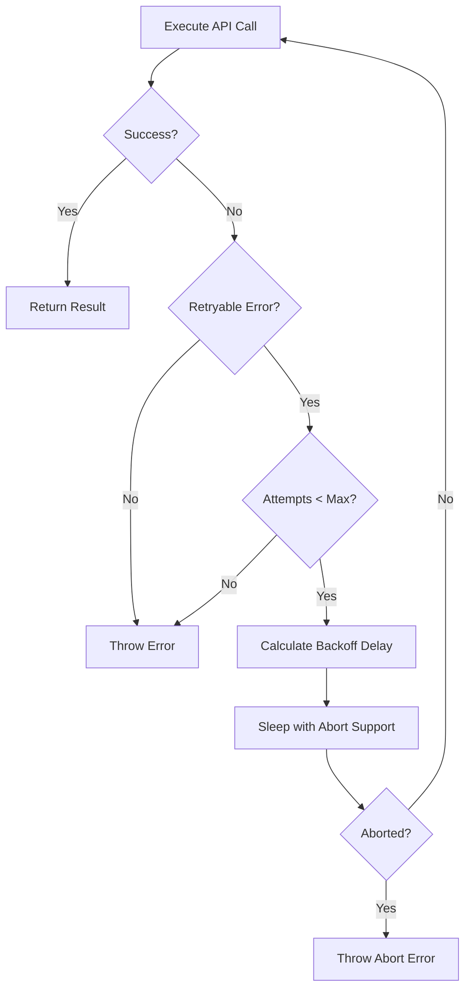

Warden automatically retries transient API failures with exponential backoff to ensure reliable analysis.

## Retry Configuration

### Schema

```typescript src/types/index.ts
export const RetryConfigSchema = z.object({
  /** Maximum number of retry attempts (default: 3) */
  maxRetries: z.number().int().nonnegative().default(3),
  /** Initial delay in milliseconds before first retry (default: 1000) */
  initialDelayMs: z.number().int().positive().default(1000),
  /** Multiplier for exponential backoff (default: 2) */
  backoffMultiplier: z.number().positive().default(2),
  /** Maximum delay in milliseconds between retries (default: 30000) */
  maxDelayMs: z.number().int().positive().default(30000),
});
export type RetryConfig = z.infer<typeof RetryConfigSchema>;
```

### Default Configuration

```typescript src/sdk/retry.ts
export const DEFAULT_RETRY_CONFIG: Required<RetryConfig> = {
  maxRetries: 3,
  initialDelayMs: 1000,
  backoffMultiplier: 2,
  maxDelayMs: 30000,
};
```

## Exponential Backoff

Warden uses exponential backoff to avoid overwhelming the API:

```typescript src/sdk/retry.ts
export function calculateRetryDelay(
  attempt: number,
  config: Required<RetryConfig>
): number {
  const delay = config.initialDelayMs * Math.pow(config.backoffMultiplier, attempt);
  return Math.min(delay, config.maxDelayMs);
}
```

### Delay Calculation

<Steps>
  <Step title="Attempt 0">
    Delay = 1000ms × 2^0 = **1 second**
  </Step>
  <Step title="Attempt 1">
    Delay = 1000ms × 2^1 = **2 seconds**
  </Step>
  <Step title="Attempt 2">
    Delay = 1000ms × 2^2 = **4 seconds**
  </Step>
  <Step title="Attempt 3">
    Delay = 1000ms × 2^3 = **8 seconds**
  </Step>
</Steps>

<Note>
The delay is capped at `maxDelayMs` (30 seconds by default) to prevent excessive wait times.
</Note>

## Retryable Errors

Warden retries specific error types:

```typescript src/sdk/errors.ts
export function isRetryableError(error: unknown): boolean {
  if (error instanceof RateLimitError) return true;
  if (error instanceof InternalServerError) return true;
  if (error instanceof APIConnectionError) return true;
  if (error instanceof APIConnectionTimeoutError) return true;

  // Check for generic APIError with retryable status codes
  if (error instanceof APIError) {
    const status = error.status;
    if (status === 429) return true;
    if (status !== undefined && status >= 500 && status < 600) return true;
  }

  return false;
}
```

### Error Types

| Error Type | Status Code | Description | Retry? |
|------------|-------------|-------------|--------|
| `RateLimitError` | 429 | Too many requests | ✅ Yes |
| `InternalServerError` | 5xx | Server error | ✅ Yes |
| `APIConnectionError` | - | Network failure | ✅ Yes |
| `APIConnectionTimeoutError` | - | Request timeout | ✅ Yes |
| `APIError` (401) | 401 | Authentication failure | ❌ No |
| `APIError` (4xx) | 4xx | Client error | ❌ No |

## Non-Retryable Errors

### Authentication Errors

Authentication failures are never retried:

```typescript src/sdk/errors.ts
export function isAuthenticationError(error: unknown): boolean {
  if (error instanceof APIError && error.status === 401) {
    return true;
  }

  // Check error message for common auth failure patterns
  const message = error instanceof Error ? error.message : String(error);
  return isAuthenticationErrorMessage(message);
}
```

<Warning>
Authentication errors require user action (login or API key update) and cannot be resolved by retrying.
</Warning>

### Subprocess Errors

IPC failures in Claude Code CLI are also non-retryable:

```typescript src/sdk/errors.ts
const IPC_ERROR_CODES = ['EPIPE', 'ECONNRESET', 'ECONNREFUSED', 'ENOTCONN'];

export function isSubprocessError(error: unknown): boolean {
  if (!(error instanceof Error)) return false;
  const errorCode = (error as NodeJS.ErrnoException).code;
  if (errorCode && IPC_ERROR_CODES.includes(errorCode)) return true;
  // ... message checking logic
  return false;
}
```

## Configuring Retry Behavior

### Programmatic Configuration

```typescript
import { runSkill } from '@sentry/warden';

const results = await runSkill(skill, files, {
  retry: {
    maxRetries: 5,
    initialDelayMs: 2000,
    backoffMultiplier: 2,
    maxDelayMs: 60000,
  },
  verbose: true, // Show retry attempts
});
```

### Auxiliary Retries

Auxiliary operations (extraction, deduplication) have separate retry limits:

```typescript src/sdk/types.ts
export interface SkillRunnerOptions {
  /** Retry configuration for transient API failures */
  retry?: RetryConfig;
  /** Max retries for auxiliary Haiku calls (extraction repair, merging, dedup, fix evaluation). Default: 5 */
  auxiliaryMaxRetries?: number;
}
```

### Configuration via Config File

```toml warden.toml
[defaults]
auxiliaryMaxRetries = 5
batchDelayMs = 1000  # Delay between parallel file batches
```

## Abort Support

Retries respect abort signals for graceful cancellation:

```typescript src/sdk/retry.ts
export async function sleep(ms: number, abortSignal?: AbortSignal): Promise<void> {
  return new Promise((resolve, reject) => {
    if (abortSignal?.aborted) {
      reject(new Error('Aborted'));
      return;
    }

    const timeout = setTimeout(resolve, ms);

    abortSignal?.addEventListener('abort', () => {
      clearTimeout(timeout);
      reject(new Error('Aborted'));
    }, { once: true });
  });
}
```

<Tip>
Press `Ctrl+C` during analysis to abort all pending retries immediately.
</Tip>

## Verbose Logging

Enable verbose mode to see retry attempts:

```bash
warden scan -v
```

```
[1/3] src/auth.ts:15-42
  Retry attempt 1/3 after 1.0s (RateLimitError: Request rate limit exceeded)
[1/3] src/auth.ts:15-42
  Retry attempt 2/3 after 2.0s (RateLimitError: Request rate limit exceeded)
[1/3] src/auth.ts:15-42
  ✓ Analysis completed after 2 retries
```

### Callback Interface

```typescript src/sdk/types.ts
export interface SkillRunnerCallbacks {
  /** Called when a retry attempt is made (verbose mode) */
  onRetry?: (
    file: string,
    lineRange: string,
    attempt: number,
    maxRetries: number,
    error: string,
    delayMs: number
  ) => void;
}
```

## Error Recovery Flow



## Best Practices

<Accordion title="Increase retries for rate-limited environments">
If you frequently hit rate limits, increase `maxRetries`:
```typescript
{
  retry: {
    maxRetries: 5,
    initialDelayMs: 2000,
  }
}
```
</Accordion>

<Accordion title="Use longer delays for unstable networks">
For unreliable connections, increase `initialDelayMs`:
```typescript
{
  retry: {
    initialDelayMs: 3000,
    maxDelayMs: 60000,
  }
}
```
</Accordion>

<Accordion title="Monitor retry frequency">
Frequent retries may indicate:
- Rate limit threshold too low
- Network connectivity issues
- API service degradation

Use verbose logging to identify patterns.
</Accordion>

<Accordion title="Handle non-retryable errors gracefully">
Authentication and subprocess errors need immediate attention:
```bash
# Check authentication
claude login

# Or switch to API key
export WARDEN_ANTHROPIC_API_KEY=sk-ant-...
```
</Accordion>

## Advanced: Custom Retry Logic

For custom retry behavior, wrap Warden calls:

```typescript
import { runSkill, isRetryableError } from '@sentry/warden';

async function runWithCustomRetry() {
  let attempts = 0;
  while (attempts < 10) {
    try {
      return await runSkill(skill, files, { retry: { maxRetries: 0 } });
    } catch (error) {
      if (!isRetryableError(error) || attempts >= 9) throw error;
      await new Promise(resolve => setTimeout(resolve, 5000));
      attempts++;
    }
  }
}
```

<Warning>
Custom retry logic bypasses Warden's exponential backoff and abort handling. Use with caution.
</Warning>
